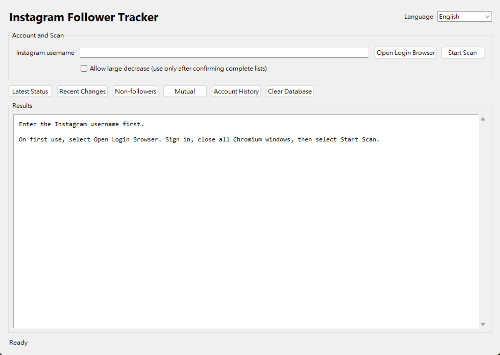

# Instagram Follow Tracker

A local desktop tool for recording changes in an Instagram account's Followers and Following lists.

The application uses Playwright to control Chromium and stores each successful scan in SQLite. It does not use an unofficial Instagram API, save passwords, or run as a background service.



## Features

- Historical Followers and Following snapshots
- Follow and unfollow change detection
- Mutual and non-follower lists
- Per-account relationship history
- Persistent Chromium login session
- Incomplete-scan protection
- English and Traditional Chinese interface
- Deactivated-account filtering when Instagram's list count is inconsistent
- Local SQLite storage

## Requirements

- Windows 11
- Python 3.10 or later (Python 3.11+ recommended)
- Playwright Chromium

## Installation

Open a terminal in the project directory and run:

```powershell
python -m venv .venv
.\.venv\Scripts\python.exe -m pip install -r requirements.txt
.\.venv\Scripts\python.exe -m playwright install chromium
```

## Run

```powershell
.\.venv\Scripts\python.exe main.py gui
```

### Portable Windows build

The packaged application is generated at:

```text
dist/InstagramFollowTracker/InstagramFollowTracker.exe
```

Double-click the EXE to start the application. Keep the complete `InstagramFollowTracker` folder together; the EXE depends on the bundled files in `_internal/`.

To rebuild the portable folder:

```powershell
powershell -ExecutionPolicy Bypass -File .\build_windows.ps1
```

The first build downloads Chromium and produces a folder of roughly 560 MB. Build output is excluded from Git.

The interface starts in English. Use the language selector in the upper-right corner to switch between **English** and **繁體中文**.

On first use, select **Open Login Browser**, sign in to Instagram manually, and close Chromium after the home page loads. Enter the signed-in username and select **Start Scan**.

The first successful scan creates the comparison baseline. Changes are reported from the second scan onward.

## Interface

| Control | Purpose |
| --- | --- |
| Language | Switches the interface between English and Traditional Chinese. |
| Open Login Browser | Opens the persistent Chromium profile for login or security checks. |
| Start Scan | Collects Followers and Following and saves a validated snapshot. |
| Latest Status | Shows the newest totals and relationship summary. |
| Recent Changes | Compares the two most recent snapshots. |
| Non-followers | Shows accounts you follow that do not follow you back. |
| Mutual Followers | Shows accounts that follow each other. |
| Account History | Shows saved events for the username entered in the field. |
| Clear Database | Deletes saved snapshots and history after confirmation. The login session is preserved. |

The **Allow large decrease** option bypasses the previous-snapshot count check. Enable it only after confirming that the captured lists are complete.

## Local Data

```text
data/tracker.db       SQLite snapshots and event history
browser_data/         Persistent Chromium profile and login session
logs/tracker.log      Diagnostic log
```

These files are excluded from Git. Do not share `browser_data/`, as it contains the saved browser session.

CAPTCHA, 2FA, checkpoints, and other Instagram security prompts must be completed manually. If either relationship list cannot be collected and validated, no snapshot is saved.

## Testing

```powershell
.\.venv\Scripts\python.exe -m unittest discover -s tests -v
.\.venv\Scripts\python.exe -m compileall -q .
```

---

## 中文操作說明

### 安裝與啟動

第一次使用時，在 VS Code 終端機執行：

```powershell
python -m venv .venv
.\.venv\Scripts\python.exe -m pip install -r requirements.txt
.\.venv\Scripts\python.exe -m playwright install chromium
```

啟動程式：

```powershell
.\.venv\Scripts\python.exe main.py gui
```

若已完成 Windows 版封裝，也可以直接開啟：

```text
dist\InstagramFollowTracker\InstagramFollowTracker.exe
```

請保留整個 `InstagramFollowTracker` 資料夾，不要只移動 EXE。若要重新建置可攜版，執行：

```powershell
powershell -ExecutionPolicy Bypass -File .\build_windows.ps1
```

### 使用方式

程式預設使用英文，可從右上角的語言選單切換為「繁體中文」。

1. 第一次使用時按「Open Login Browser／開啟登入瀏覽器」，登入 Instagram 後關閉 Chromium。
2. 輸入目前登入的帳號名稱，不需加上 `@`。
3. 按「Start Scan／開始掃描」。第一次掃描會建立比較基準，第二次開始才會顯示變動。

### 按鈕說明

| 按鈕 | 用途 |
| --- | --- |
| Language／語言 | 切換英文與繁體中文介面。 |
| 開啟登入瀏覽器 | 登入 Instagram，或處理登入過期與安全驗證。 |
| 開始掃描 | 抓取 Followers 與 Following，驗證完成後儲存 Snapshot。 |
| 最新狀態 | 查看最新人數與關係統計。 |
| 最近變動 | 查看最近兩次掃描之間的變化。 |
| 未回追名單 | 查看你有追蹤、但沒有追蹤你的帳號。 |
| 互追名單 | 查看目前互相追蹤的帳號。 |
| 帳號歷史 | 查詢上方欄位中指定帳號的歷史紀錄。 |
| 清空資料庫 | 確認後刪除所有 Snapshot 與歷史紀錄，不會清除登入狀態。 |

「允許大幅下降」只有在確認名單完整時才建議勾選。掃描期間請保持 Chromium 開啟；若名單抓取或驗證失敗，程式不會儲存不完整的 Snapshot。
